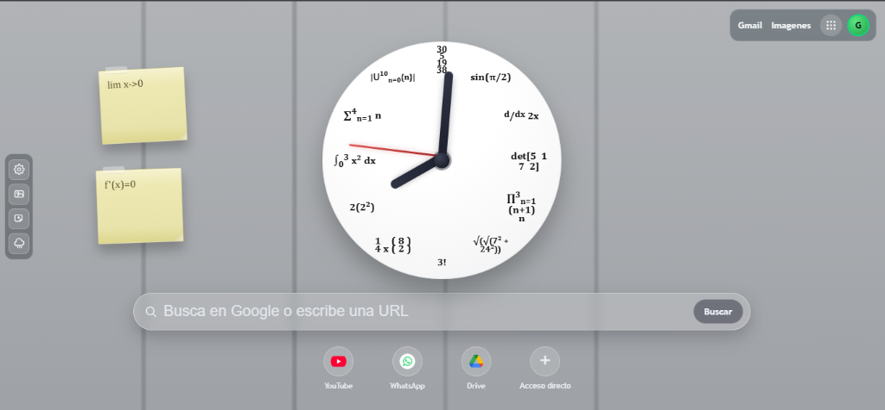
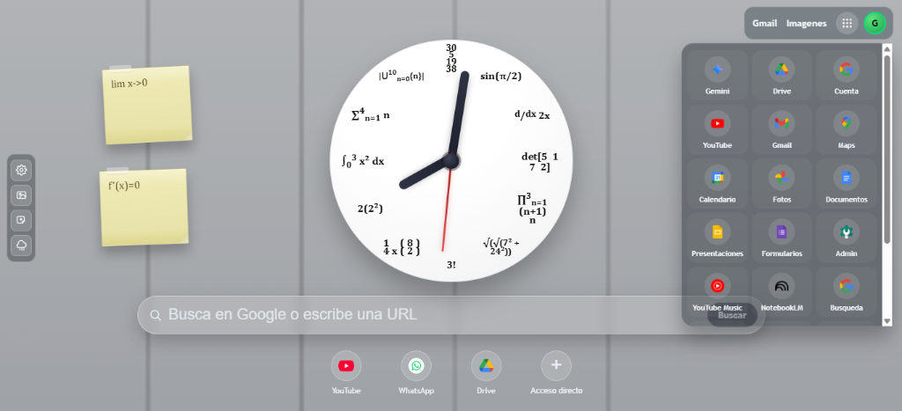

# NEW TAB TG FAST - Extencion

Esta es una extension de navegador personalizable que reemplaza la nueva pestana con un reloj matematico realista, barra de busqueda de Google, accesos directos y un panel de ajustes avanzado.

## Vistas del Proyecto

## Caracteristicas principales

- Reloj analogico con expresiones matematicas reales en lugar de numeros.
- Barra de busqueda integrada para Google y navegacion directa por URL.
- Accesos directos personalizables a sitios web y aplicaciones de Google.
- Panel de personalizacion lateral para ajustar escala, fondo, desenfoque y visibilidad de elementos.
- Sistema de notas adhesivas para recordatorios rapidos.
- Soporte para cambio de fondo de pantalla desde archivos locales.
- Interfaz reactiva con micro-animaciones suaves.

## Instalacion

1. Descarga o clona este repositorio.
2. Abre tu navegador basado en Chromium (Chrome, Edge, Brave, etc.).
3. Ve a la pagina de extensiones (chrome://extensions).
4. Activa el Modo de desarrollador.
5. Haz clic en "Cargar descomprimida" y selecciona la carpeta del proyecto.

## Estructura de archivos

- index.html: Estructura principal y contenedores de la interfaz.
- css/styles.css: Definicion de estilos, animaciones y diseño responsivo.
- js/clock.js: Motor de calculo y renderizado del reloj matematico.
- js/config.js: Gestion de la configuracion persistente y valores predeterminados.
- js/newtab.js: Logica central de la interfaz, gestion de eventos y control de ajustes.
- manifest.json: Definicion de permisos y configuracion de la extension.

## Documentacion de Funciones Detallada

### clock.js

#### Clase ClockManager
Gestiona el ciclo de vida y la precision visual del reloj.

- **validateElements()**: Asegura que los punteros del reloj esten presentes en el DOM antes de iniciar.
- **init()**: Configura las propiedades iniciales y activa el bucle de animacion.
- **startAnimation()**: Utiliza requestAnimationFrame para actualizar la posicion de las manecillas 60 veces por segundo.
- **stopAnimation()**: Pausa la actualizacion del reloj para ahorrar recursos.
- **resumeAnimation()**: Reactiva el movimiento despues de una pausa.
- **getCurrentTime()**: Captura la hora exacta del sistema.
- **calculateAngles(time)**: Traduce el tiempo en grados de rotacion (360 grados por ciclo).
- **updateClock()**: Aplica las transformaciones CSS de rotacion a las manecillas.

### config.js

- **applyClockConfig(config)**: Actualiza los parametros del reloj (como el desfase horario) basandose en la configuracion del usuario.
- **loadDefaultConfig()**: Proporciona los valores de fabrica para la primera ejecucion.

### newtab.js

#### Nucleo de la Interfaz
- **init()**: Orquestador principal que carga ajustes, inicializa el reloj y renderiza la UI.
- **cacheElements()**: Optimiza el rendimiento guardando referencias a elementos frecuentes del DOM.
- **renderGoogleAppsLauncher()**: Genera dinamicamente la cuadricula de servicios de Google (Gmail, Drive, etc.).
- **createGoogleAppTile(app)**: Crea el contenedor visual y el enlace para cada aplicacion.
- **createAddAppTile()**: Renderiza el boton interactivo para expandir la lista de accesos.

#### Gestion de Accesos Directos
- **openShortcutModal(mode)**: Muestra el cuadro de dialogo para configurar nuevos sitios.
- **closeAddShortcutModal()**: Oculta el dialogo y limpia los campos de entrada.
- **setAppEditMode(enabled)**: Permite entrar en un estado donde los accesos pueden ser eliminados o reorganizados.
- **bindAppTileLongPress(tile)**: Detecta pulsaciones prolongadas para activar el modo de edicion.

#### Notas Adhesivas
- **getStickyNotesList()**: Recupera todas las notas activas del almacenamiento.
- **createStickyNote()**: Genera una nueva nota en una posicion predeterminada.
- **renderStickyNoteMarkdown(rawText)**: Convierte texto plano en formato legible con soporte basico de estilos.
- **setStickyNoteEditMode(enabled)**: Activa el area de escritura en las notas.
- **clampStickyNotePosition(x, y)**: Evita que las notas se desplacen fuera del area visible de la pantalla.

#### Ajustes y Personalizacion
- **loadSettings()**: Lee las preferencias del usuario (escala, desenfoque, visibilidad).
- **saveSettings()**: Almacena de forma persistente cualquier cambio realizado en el panel.
- **updateUIFromSettings()**: Aplica instantaneamente los cambios visuales cuando se mueven los controles del panel.
- **toggleVisibility(elementId, visible)**: Funcion generica para mostrar u ocultar componentes de la interfaz.
